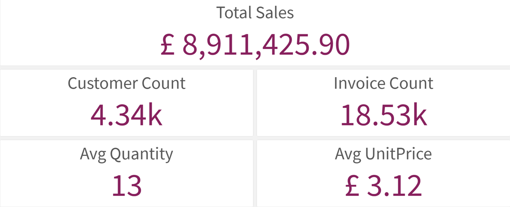
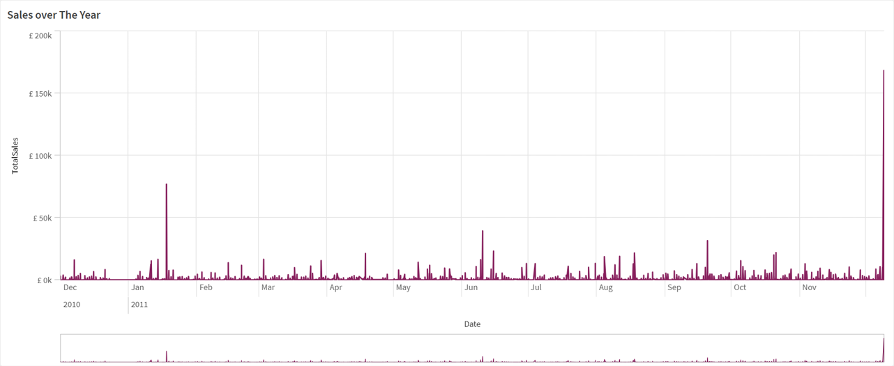
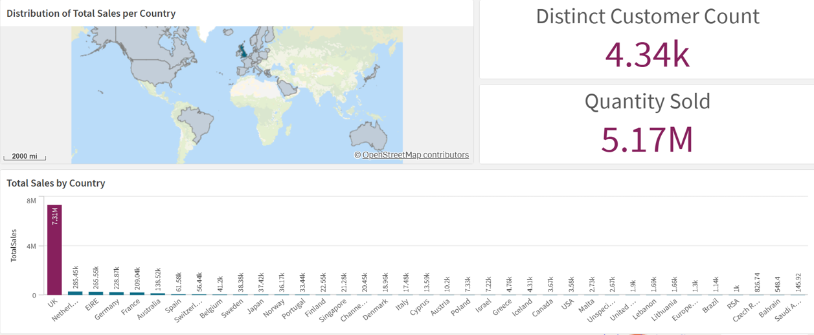
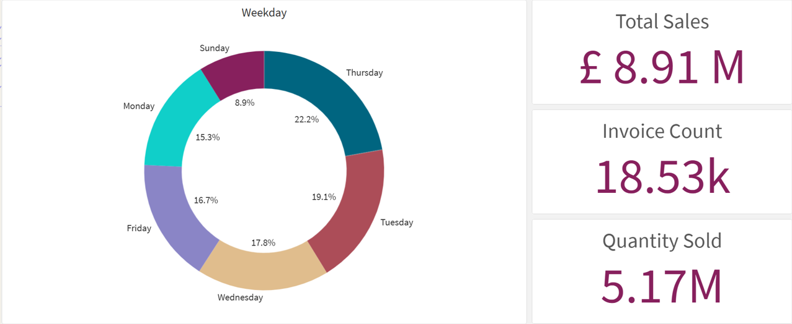

# E-Commerce Sales Analysis & Dashboard

## Overview
Analyzed online retail transaction data to uncover sales trends, top-performing products, and geographic revenue distribution.

## Tools
Python (Pandas), Data Cleaning, Qlik Sense

## Key Analysis
- Cleaned and processed transactional dataset (~500K+ records)
- Engineered key metrics such as total sales and time-based features
- Built interactive dashboard to analyze performance across time, products, and regions

## Key Insights
- Total sales reached ~£8.9M with strong concentration in the UK market
- Sales spike significantly during holiday periods (December peak)
- A small number of products drive a large portion of revenue
- Certain weekdays outperform others in total sales

## Business Impact
Supports decision-making in:
- Inventory planning (focus on high-demand products)
- Marketing strategy (seasonal campaigns)
- Geographic expansion (target high-performing regions)

## Key Visuals

### KPI Overview

### Sales Trend Over Time

### Sales by Country

### Sales by Weekday

